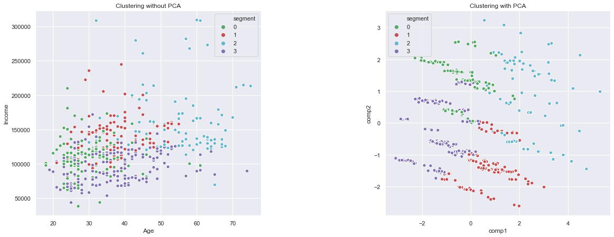
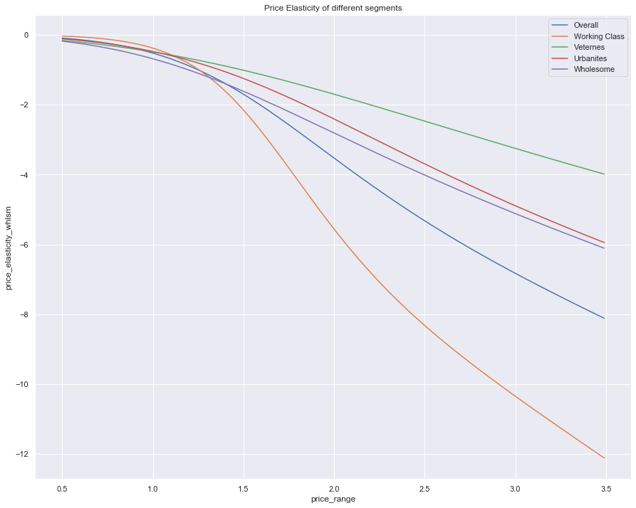
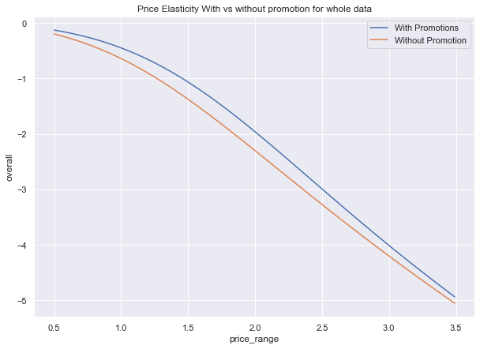
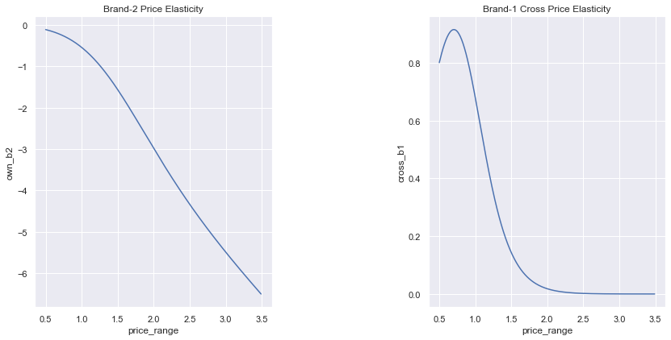

# Context and Data
**The dataset consists of information about the purchases of chocolate candy bars(5 different brands) of 500 individuals from a given area when entering a physical ‘FMCG’ store in a period of 2 years. All data has been collected through the loyalty cards they use at checkout. The data has been preprocessed and there are no missing values. In addition, the volume of the dataset has been restricted and anonymized to protect the privacy of the customers.**

**Description of each column and what they represent are present in [purchase-data-legend file](purchase-data-legend.pdf)**

# Objective
**There are two main objectives of the projects**
- **Customer Segmentation**

- **Price Elasticity**

## Customer Segmentation

**Dividing our customers into different segments(Groups/buckets) such that customers in one segment would be homogenous in terms of the following**
- These groups will have comparable purchase behaviors 
- Members from the same segment respond similarly to different marketing activities 
- Members from different segments respond differently to different marketing activities 

As we have both customer purchase data and customer demographic data, we will be using appropriate frameworks/algorithms best suited for each of those to perform segmentation

**Carrying out Analysis on each of segments for KYC(know your customer)**

**This process would help the marketing team to have a better understanding of our customers, enabling them to design and implement efficient marketing strategies suitable for each of the segments to maximize purchase probability**

## Price Elasticity
**Price Elasticity of a product is a key indicator in determining a products purchase probability or how likely is a customer to purchase a given product at that price point**

1) **Simulating Price elasticity of Candy's at different price points**

2) **How do these Price Elasticity effect in the presence/absence of a promotion**

**Performing the above tasks would help us in the following ways**
- As Revenue = Sales*Price, it would help us in determining the optimal price at which we would have high purchase probability, thus increasing our revenue
- Help us decide %discount, for the next sale
- If we are about to release a new product it could give us insight into what price range would be a safe bet

**As we have 5 different brands and their respective purchase data, Computing cross price elasticity, of our brand with respect to others, Doing this would give us the following insights**
- Which brand can be considered in our product category as the closest competitor(ie: Which brand is more likely to be an alternative to our brand for customers currently purchasing our products)
- Forecast how sales or market share of our brand would impact based on changes in the prices of our competitors
- In the case of huge discounts from our competitors, how much should we decrease our prices in our order to regain the market share 

# Methodology

## Segmentation

- **For Segmentation with demographic data, K-means clustering is used. As the results initially were not satisfying PCA was used as a means to extract latent features and K-Means was applied on these latent features we obtained  4 clusters as optimal(verified by Elbow method)**

- **For segmentation based on transaction/purchase data RFM(Recency Frequency Monetary) analysis is used do segment customers**

## Price Elasticity

- **Logistic Regression is used to model the relationship between prices and purchases probabilities**

- **Using the model to further simulate purchase probabilities for different price ranges, These predictions along with coefficients of the model are used to compute Price Elasticity**

- **Multivariate Logistic Regression is used to compute Cross Price Elasticity**

# Results

*All of these are shown in the notebooks with specifics*

## Segmentation

### K-Means Clustering
- **Based on the demographic data such as their income, where they live, age, etc...Segments are labeled as Working Class, Urbanities, Veterans and wholesome(Names of the segments are subjective)**

- **Various characteristics of each segment were found such as the following**
    - **which brand does each segment spend more money on** 
    - **which segment visits the store more often**
    - **which customer purchase more when in promotion**
 
- **So when we have a new customer signed-up just based on his/her demographic data we can classify them into one of the segments which would increase the probability of targeted marketing and send personalized promotion**

**A few other results of segmentation are mentioned in the price elasticity section below**

## RFM Analysis

**Based on the purchase data of each customer spanning across two years, they were classified into the following segments**

- Champion Customers
- Loyal Customers
- Potential Loyalist
- Recent Customers
- Promising Customers 
- Customers Needing Attention
- About To Sleep
- At-Risk Customers 
- Can’t Lose Them(valuable)
- Lost

**Unlike in segments generated using K-Means these are industry-standard labels, How to treat these segment to benefit the most is also well (documented)[https://www.putler.com/rfm-analysis/], these segments would also help us in identifying customers most likely to churn**

## Price Elasticity

**Following are the insights as the results of computing Price elasticity**
- For a given product at a price point, we can predict the purchase probability of  what would happen if the price varies by x%
    - if we increased our prices by 1% at a price of 1.25$ then purchase probability of our product would go down by 1.04%, this probability would increase to 3.5% if it was to increase of 1% at 2$
    - Thus concluding that inc of the same 1% at different price points has different impacts on our sales
    
    
    
- We were able to find out which segment of customers are most sensitive to price changes than others
    - Working Class is the most sensitive to price changes
    
    
    
- We found out that people were less elastic to price increases when there was a sale, meaning advertising the price of a product as a discounted price would make customers less sensitive to price increases of the product

**These insights can assist us in making decisions like budget allocation for marketing/advertisement of each segment for a promotion**

**Following are the insights as the result of computing cross-price elasticity, considering our brand as brand-2**
- We found out based on sales data which brands were our closest competitor(ie which brand is more likely to be preferred by our customers as an alternative)
    - Closest competitor to our brand is brand-1
  
- We were able to compute by how much would our brand's Sales(purchase probability) effect as the result of a change in our competitor's prices
    - if brand-1 decreased the price of its product by 1%(at its mean price) then it would decrease sales(purchase probability )of our brand by 0.2%

- We computed what if we decreased our product's price by 1% as a counter for brand-1 discount, then we would see a rise of around 1% in our sales

- We also computed by how much should we decrease our prices in order to maintain the market share if our competitor happens to give discounts
    - It was computed that if brand-1 increases it's price by 1% then to nullify the decrease in our sales we could simply decrease our price by 0.2%
    

**These insights would help us in making strategic decisions about adjusting our prices to gain or maintain the market share as the result of our competitors altering their prices**

# Limitation

- **One of the major drawbacks in computing price elasticity is we are trying to model purchase probability of customers using only the price of the product, which means we are suuming price of a product is the only factor stopping or encouraging a customer to purchase a product which we know is not the case in real world**

  

- **Price is undoubtedly one of the important features or variables which customer uses to make the decision of whether to purchase or not, but it isn't the only factor he/she would consider**

  

- **Other factors like customers personal taste, which things does customer gravitates towards does that brand or product possess such characteristics, customers needs, etc, also play a major role, having said that for some products which can be called commodities, price would be more or less the only factor which customer would consider**

  

- **So Price Elasticity analysis would be more accurate for products which are comodites and chocolate isn't a comodity, For products other than comodity we would require other features which can takes into consideration elements such as customers psychology,taste's, requirements etc.**
